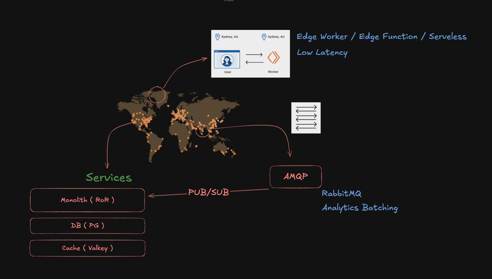

# Introdução

Este projeto é pra substituir completamente o `bitly.com` para uso pessoal.

A estrutura é simples, primeiro o usuário acessa ao Admin, cria o link e envia para alguém em algum lugar do mundo.

A pessoa entra no link encurtado por um worker distribuído da Cloudflare ( não importa se é Cloudflare, AWS Lambda, Azure Function ), é validado a key da url ao buscar no Valkey ( ou Redis, ou Cloudflare KV ), se for válido, é disparado uma mensagem por RabbitMQ ( Sem esperar o ACK ) e já redireciona para o site. Caso contrário, o usuário é redirecionado para um 404.

O mais importante aqui, é que temos um worker com baixa latência, e também um KV com baixa latência.
Por que não adianta ter um worker distribuido e ter um KV no outro lado do mundo.

Também garantimos que temos uma mensageria resiliente e com boa performance. 

Este projeto não é pequeno demais para usar soluções interessantes como PGMQ, Solid Queue, ou algo do tipo. Nem grande demais para usar Apache Kafka.

A agregação dos dados aqui, não precisa ser em tempo real, então não importa se estiver alguns segundos atrasados. Então o servidor pode estar em uma VPS, self hosted ou em um App Service qualquer.

