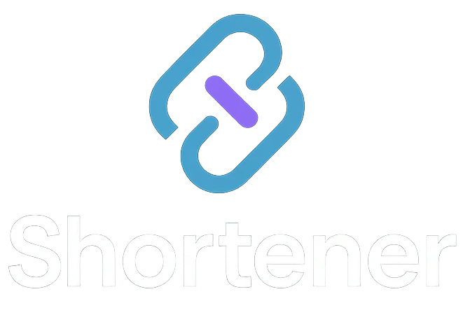
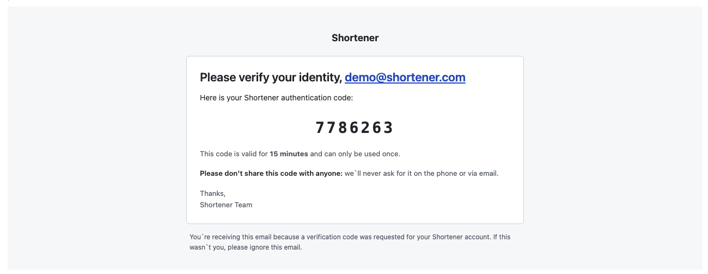

# Introduction

    

    This project is meant to completely replace <code>bitly.com</code> for personal use.

------------

The structure is simple: first, the user accesses the Admin, creates the link, and sends it to someone somewhere in the world.

The person enters the shortened link through a Cloudflare distributed worker (it doesn't matter if it's Cloudflare, AWS Lambda, Azure Function), the URL key is validated by querying Valkey (or Redis, or Cloudflare KV), if valid, a message is dispatched through RabbitMQ (without waiting for ACK) and immediately redirects to the site. Otherwise, the user is redirected to a 404.

The most important thing here is that we have a low-latency worker, and also a low-latency KV.
Because there's no point in having a distributed worker and having a KV on the other side of the world.

We also ensure we have resilient messaging with good performance.

This project is not too small to use interesting solutions like PGMQ, Solid Queue, or similar. Nor too large to use Apache Kafka.

Data aggregation here doesn't need to be real-time, so it doesn't matter if it's a few seconds delayed. Therefore, the server can be on a VPS, self-hosted, or on any App Service.

# Passwordless Authentication

Let's keep Authentication simple.

